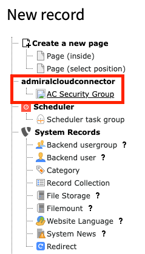
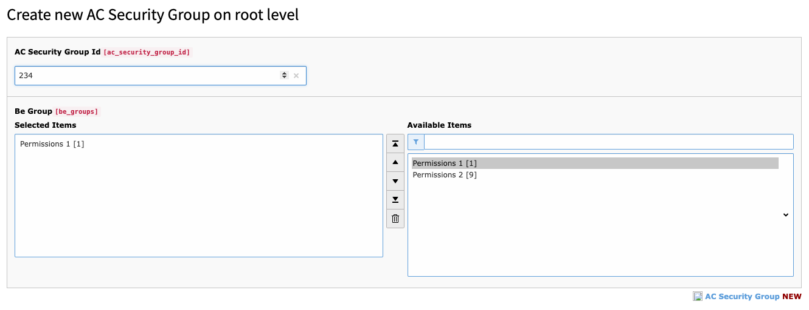

.. include:: /Includes.txt

.. _AcSecGroup:

===============================
Admiralcloud Security Groups
===============================

For the initial setup you have to send a list of usergroups you need for AdmiralCloud. AdmiralCloud will create these groups (referred to as AC Security Group) and send back a list of ID's

These ID's of the AC Security Groups have to be matched with TYPO3 usergroups.

Go to page id 0 which is the same backend page where usergroups are created.

Create a new record and choose "AC Security Group"

Now enter the ID of the AC Security Group into the field "AC Security Group Id" and choose the matching usergroup.

.. toctree::
   :maxdepth: 5
   :titlesonly:

   LocalConfiguration
   FileStorage
   UserConfiguration