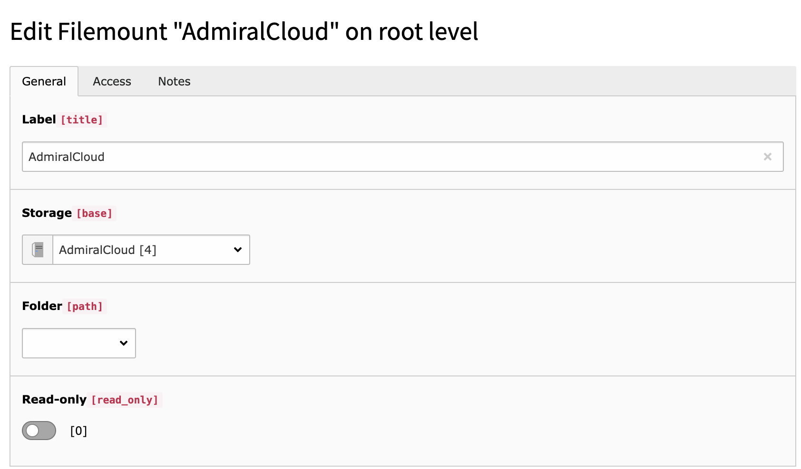
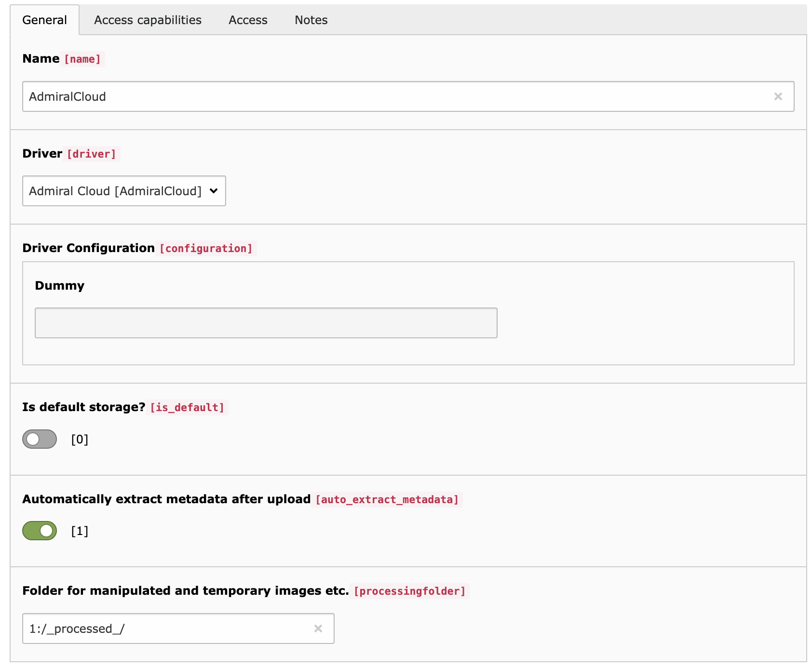

.. include:: /Includes.txt

.. _FileStorage:

============
FileMount
============

A Filemount with AdmiralCloud has to be created in order to gain users access to AdmiralCloud.

Create a new filemount and choose the AdmiralCloud Filestorage.

If the Filestorage does not exist create the Filestorage manually.
It is important to select "AdmiralCloud" as driver.

If the Filestorage is setup properly you can use, you can create a Filemount.

When Filemound is properly setup, you have to assign the Filemount in the "Mounts & Workspaces" tab in the Usergroup or User properties:

.. image:: ../Images/assign-fm.png

