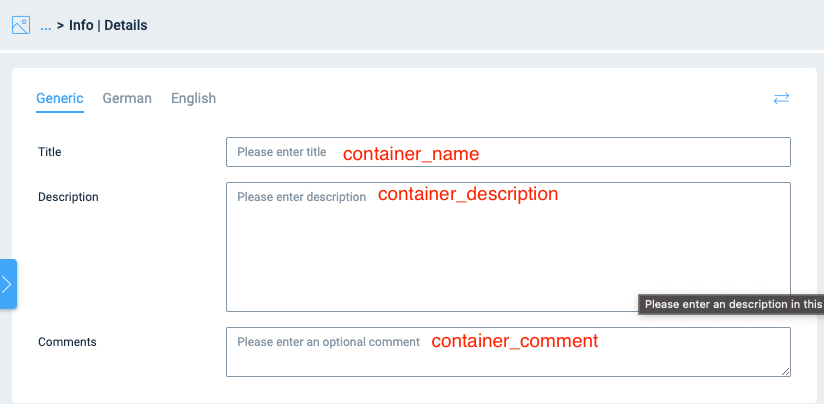

.. include:: /Includes.txt

.. _LocalConfiguration:

======================================================
Setting up the LocalConfiguration.php for your system
======================================================

We suggest to put the code into a CustomConfiguration.php file.

First add the following lines to LocalConfiguration.php

..  code-block:: php
    :caption: Code

        if (is_file(__DIR__ . '/CustomConfiguration.php')) {
           require_once __DIR__ . '/CustomConfiguration.php';
        }

Then create a file typo3conf/CustomConfiguration.php with following content:

..  code-block:: php
    :caption: Code

       <?php

       putenv('ADMIRALCLOUD_ACCESS_SECRET=xxxxxxxx-xxxx-xxxx-xxxx-xxxxxxxxxxxx');
       putenv('ADMIRALCLOUD_ACCESS_KEY=xxxxxxxxxxxxxxxxxxxxxx');
       putenv('ADMIRALCLOUD_CLIENT_ID=xxxxxxxx-xxxx-xxxx-xxxx-xxxxxxxxxxxx');
       putenv('ADMIRALCLOUD_DISABLE_FILEUPLOAD=0');
       putenv('ADMIRALCLOUD_FLAG_CONFIG_ID=0');

       putenv('ADMIRALCLOUD_DISABLE_FILEUPLOAD=1');
       putenv('ADMIRALCLOUD_IS_PRODUCTION=1');
       putenv('ADMIRALCLOUD_IMAGE_CONFIG_ID=238');
       putenv('ADMIRALCLOUD_VIDEO_CONFIG_ID=239');
       putenv('ADMIRALCLOUD_DOCUMENT_CONFIG_ID=240');
       putenv('ADMIRALCLOUD_AUDIO_CONFIG_ID=241');
       putenv('ADMIRALCLOUD_FLAG_CONFIG_ID=10');
       putenv('ADMIRALCLOUD_IFRAMEURL=https://t3intpoc.admiralcloud.com/');

        //optional override of enviromental variables
       putenv('ADMIRALCLOUD_METADATA_FIELD_OVERRIDE_title=container_name');
       putenv('ADMIRALCLOUD_METADATA_FIELD_OVERRIDE_alternative=meta_alttag');
       putenv('ADMIRALCLOUD_METADATA_FIELD_OVERRIDE_description=container_description');
       putenv('ADMIRALCLOUD_METADATA_FIELD_OVERRIDE_copyright=meta_iptc_copyrightNotice');

        $GLOBALS['TYPO3_CONF_VARS']['SYS']['caching']['cacheConfigurations']['admiral_cloud_connector'] = [
            'frontend' => \TYPO3\CMS\Core\Cache\Frontend\PhpFrontend::class,
            'backend' => \TYPO3\CMS\Core\Cache\Backend\FileBackend::class,
            'groups' => [
                'all',
                'system',
            ],
            'options' => [
                'defaultLifetime' => 0,
            ]
        ];

You have ro replace the credentials for ADMIRALCLOUD_ACCESS_SECRET, ADMIRALCLOUD_ACCESS_KEY and ADMIRALCLOUD_CLIENT_ID with your own. These will be send to you by AdmiralCloud via Mails and SMS.

ADMIRALCLOUD_METADATA_FIELD_OVERRIDE_title, ADMIRALCLOUD_METADATA_FIELD_OVERRIDE_alternative, ADMIRALCLOUD_METADATA_FIELD_OVERRIDE_description and
ADMIRALCLOUD_METADATA_FIELD_OVERRIDE_copyright are optional settings. The part after the last underscore corresponds with the respective field name in TYPO3. After the equal sign fill in the name of the name of the Admircal Cloud field from which you like to pull the data.

