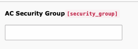

.. include:: ../Includes.txt

.. _UserConfiguration:

=======================
The user configuration
=======================

Backend users
--------------

The authorization between AdmiralCloud and TYPO3 is done by the e-mail address. The field e-mail address is  **obligatory** for every user.

If the :ref:`LocalConfiguraiton.php <LocalConfiguration>`, :ref:`AC Security Groups <AcSecGroup>`, :ref:`AdmiralCloud filemount <FileStorage>`  and e-mail address are properly setup, each time a newly created editor connects to AdmiralCloud from the TYPO3 backend, his or hers access rights are automatically matched to the AC Security Groups in AdmiralCloud

AC Security Group
-------------------

In the user settings there is a new field "AC Security Group".

This field overrides the AC Security Group permissions inherited by the usergroup. If a user shall have access to multiple AC Security Groups but shall not be a member of usergroup that inherits these permissions, then you can enter the ID's of the AC Security Groups to which the user shall have access here.

TYPO3 Administrator users are usually not a member of any group. The "AC Security Group" field was introduced so that no empty user group has to be created:You can add any random number. This field is **obligatory** for Administrators or else they will not have access to AdmiralCloud.

AC Cropping
_____________

Allow cropping tool for AdmiralCloud images: check the usergroup permission for "Image crop for AdmiralCloud (tx_admiralcloudconnector_crop)" in "File Reference" on tab "Access Lists" in section "Allowed excludefields".

.. toctree::
   :maxdepth: 5
   :titlesonly:

   LocalConfiguration
   AcSecGroup
   FileStorage

