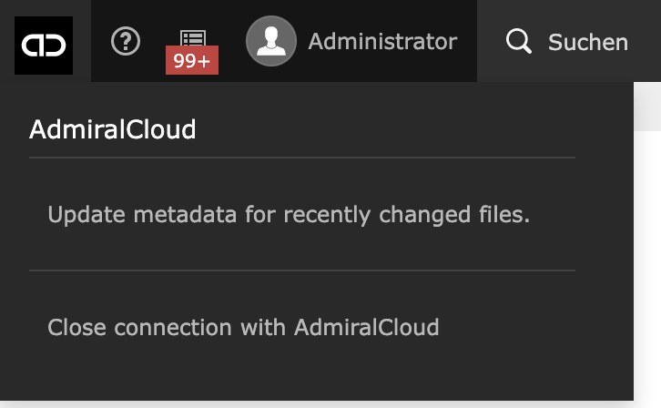

.. include:: ../../Includes.txt

.. _about:

FAQ?
================

**What is a CDN?**
A CDN (content delivery network) is a group of geographically distributed and interconnected servers around the globe.
A CDN automatically choose the network location closest to the user, thus files are delivered much faster.

**Are my TYPO3 pages cached in AdmiralCloud?**
TYPO3 pages will not be cached in AdmiralCloud. AdmiralCloud only works for files referenced within a TYPO3 installation.

**Does this extension work with the free version of AdmiralCloud?**
No. The free version does not have support the AdmiralCloud API. Support of the free version is in planning for future releases but AdmiralCloud has to make some changes on their side first.

**When I try to use AdmiralCloud all I can see is the loading screen. What should I do?**

Close the connection manually by clicking on "Close connection to AdmiralCloud". This will re-establish the connection next time you use it:

